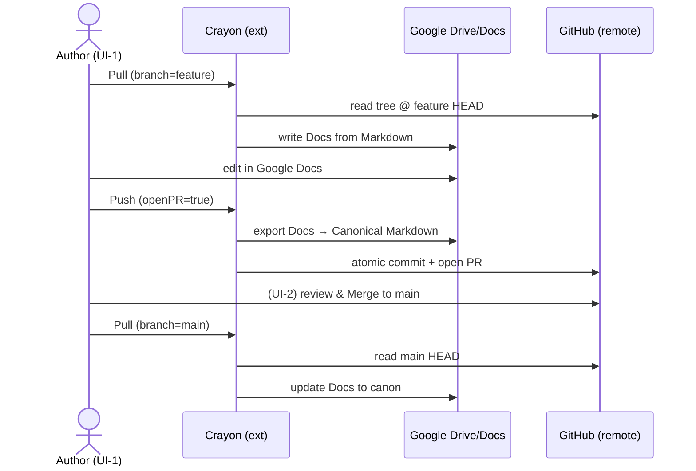
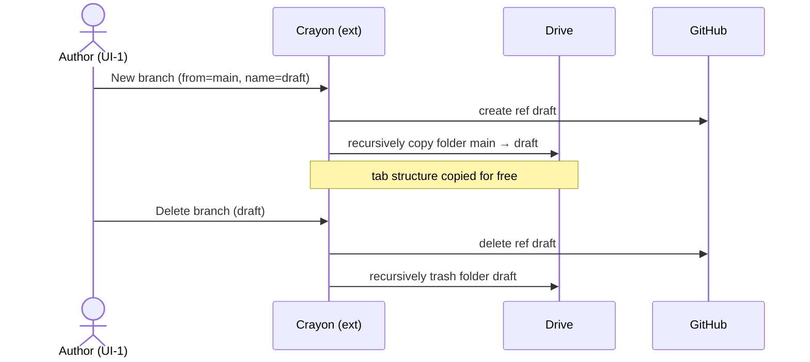
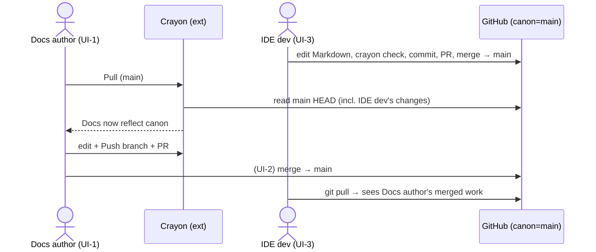
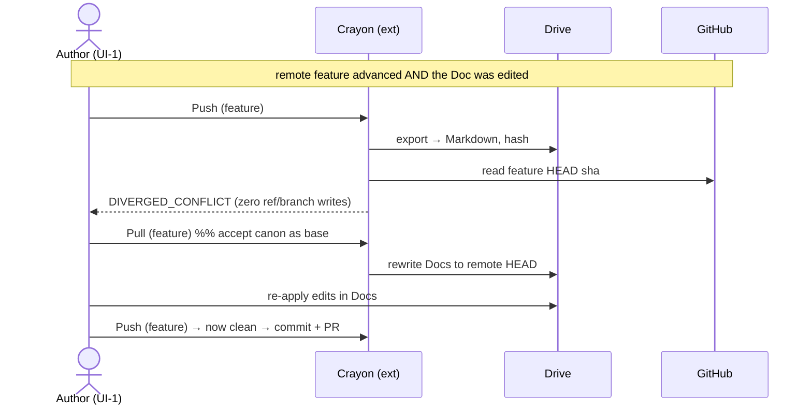
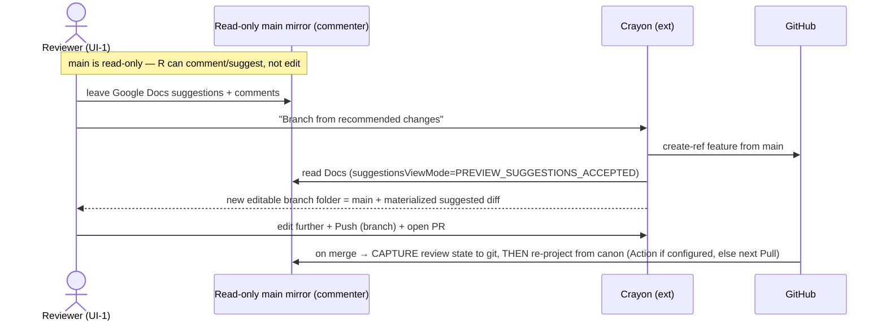

# Crayon — Specification (v1)

> Working name: **Crayon**. A deliberately small seam between Google Docs (ergonomic editor) and
> GitHub (canonical version-controlled record). This document is a *specification*, not an
> implementation. No code is written until this is approved.

---

## Context — why this exists

People want to *write* in Google Docs (real-time multiplayer, comments, suggestions, zero setup) but
*govern* text the way software is governed: branches, history, review, and code-driven policy
(CI/CD). Today both systems silently claim to be "the" record, and reconciling them is manual and
error-prone.

Crayon resolves this by assigning unambiguous roles drawn straight from git's own mental model:

- **GitHub = remote.** The canonical record. Branches, history, PRs, and policy live here.
- **Google Doc = shared local working copy.** Ergonomic, multiplayer, *disposable* — it is a checkout
  of one branch, never the source of truth. **The default branch (`main`) is the exception:** its
  Drive mirror is **read-only** — a projection of canon you read/review/comment on, never author (see
  "The read-only `main` mirror"). Editing happens on **branch** copies.
- **Crayon (Chrome extension) = the working-copy tooling** — the `git` you run against your checkout:
  pull, push, branch, open PR, navigate.
- **`crayon` (Python CLI) = minimalist governance tooling** — run by a developer in a real IDE to
  scaffold a repo and author CI/CD rules (GitHub Actions running `crayon check`) and content routes
  (`crayon publish`). **Branch protection itself is configured in GitHub's web UI** — Crayon does not
  duplicate GitHub governance. Not needed for daily use.

The design is **opinionated and serverless**: it supports *one* blessed workflow well rather than all
possible workflows. There is no backend service to host — the extension talks directly to the GitHub
and Google APIs from the browser; the CLI runs offline against the GitHub API.

### MVC framing (the user's framing, made precise)
- **View + Control** = Google Docs (what the author sees and edits) + the Crayon popup (git controls).
- **Model** = the GitHub repo (canonical state). **Canon is the GitHub remote `main` branch.**
- **Governance** has two halves: *authoring* policy as code (CLI/IDE → `.github/workflows`, branch
  protection) and *enacting* it (Pull-Request review + merge, which happens on **GitHub web**).

---

## The core model (this is the whole idea)

A branch is a **Drive folder** (a shared local checkout), and the repo's file tree is materialized
inside it. This escapes the tab bottleneck: adding a file = adding a *Doc* (fully supported by the
Drive API), not adding a *tab* (not supported). Tabs become an *optional* grouping, not the only
mechanism.

```
GitHub repo  ──────────────  Google Drive  "Crayon / <owner>/<repo>"
  ├ branch: main     ⇄  Folder "main"     (shared local checkout of main)
  │    ├ intro.md            ⇄  Doc "intro"            (untabbed Doc = one file)
  │    ├ method.md           ⇄  Doc "method"
  │    └ appendix/           ⇄  Doc "appendix" WITH TABS  (tabbed Doc = a directory of files)
  │         ├ a.md                ⇄  tab "a"
  │         ├ b.md                ⇄  tab "b"
  │         └ .crayon-tabs.json   (marker: this dir IS a tabbed Doc, not a plain folder)
  ├ branch: draft-x  ⇄  Folder "draft-x"
  └ branch: draft-y  ⇄  Folder "draft-y"
```

Invariants:
1. **One repo ⇄ one top-level Drive folder.** It holds one *sub-folder per active branch*.
2. **One branch ⇄ one Drive folder** = the shared local checkout of that branch's whole file tree.
3. **Three node mappings** between the git tree and Drive:
   - **untabbed Google Doc ⇄ a single `.md` file**
   - **tabbed Google Doc ⇄ a directory of `.md` files** (one tab per file) **+ a `.crayon-tabs.json`
     marker** so the directory is self-identifying as a Doc.
   - **Drive sub-folder ⇄ a directory** with *no* marker (children mapped recursively).
   The marker file is the "simple mechanism" that disambiguates the two directory kinds on the
   GitHub side. (See "Directory disambiguation" below.)
4. **GitHub is canonical.** Conflicts resolve in GitHub's favor by construction: the folder is
   "local", you `push` it to make it real.
5. **Branch lifecycle is mirrored.** Create branch → copy the base branch's folder (recursively).
   Delete branch → trash the branch folder (recursively).

This is `git`'s local/remote split, with a Drive folder playing the role of a *shared* working
directory, Docs playing the role of files, and tabs as optional within-file grouping.

---

## Design decision: branch = folder (recommended) vs branch = single tabbed Doc

You asked for the pros/cons. Two viable shapes:

**Option A — branch = one Google Doc, tabs = files** (the simplest to build):

| Pros | Cons |
|---|---|
| Fewest Drive objects; one editing surface per branch (single ergonomic canvas) | **Hard ceiling: tab-CRUD isn't in the Docs API.** Adding/removing a *file* needs a manual tab add/remove in the UI |
| Pull/Push is a single-Doc operation — trivial | Doesn't scale past small N; no real subdirectories |
| Branch copy/delete = copy/trash one Doc | The biggest v1 risk lives on the critical path |

**Option B — branch = a Drive folder of Docs** (recommended; **accepted**):

| Pros | Cons |
|---|---|
| **Removes the tab bottleneck from the critical path** — add/remove file = create/trash a *Doc* (Drive API supports this) | More moving parts: Pull/Push become a *tree reconciliation*, not one call |
| Scales to many files and real subdirectories | Directory ambiguity (folder vs tabbed-Doc) — needs the marker mechanism below |
| Tabs become *optional* — used only to group a directory into one surface; tab limit only bites there, and degrades gracefully | A branch is spread across several Docs, so "open the branch" is "open a folder," less of a single canvas |
| Maps honestly onto how real repos look | Branch copy/delete must recurse (Drive has no one-call deep folder copy) |

**Decision: Option B.** It moves the only serious technical limitation (no tab CRUD) *off*
the common path, at the cost of tree-walking logic that is bounded and well understood. Option A's
single-canvas ergonomics are preserved as a *special case of B*: a branch with one tabbed Doc.
N=1 (one file) is just a branch folder with one untabbed Doc — fully API-supported, zero tabs.

### Directory disambiguation (the "simple mechanism")
On the GitHub side both a Drive folder and a tabbed Doc are directories. Rule:

> **A directory containing `.crayon-tabs.json` IS a tabbed Google Doc; any other directory is a plain
> Drive folder.**

`.crayon-tabs.json` holds `{ docId, tabs: [{tabId, title, file}], order }`. It is:
- **self-describing** (survives manual git edits / clones without a central index),
- **a one-bit test** for the sync engine while walking the tree,
- redundantly cross-listed in the branch-root `.crayon/manifest.json` for whole-tree validation.

A standalone untabbed Doc maps to a plain `.md` file (no directory, no marker), so file-vs-directory
already separates "untabbed Doc" from "tabbed Doc / folder", and the marker separates the latter two.

---

## Hard technical constraints discovered in research (these shape v1)

1. **GitHub App device flow → no server, least-privilege token.** "Login with GitHub" via the device
   flow of a **GitHub App** needs only a public `client_id`, no client secret, no token-exchange
   backend — and issues **user-to-server tokens scoped to the app's installed repos** (per-repo,
   short-lived, refreshable), not a broad classic-OAuth `repo` token. This keeps Crayon serverless
   *and* least-privilege on the GitHub side. **Public repos need no extra setup** (encouraged — the
   easiest UX); **private repos are supported** but require installing the App on that repo (heavier
   setup, only when needed). Fine-grained PAT paste remains a fallback.
2. **Google OAuth from the extension** via `chrome.identity.launchWebAuthFlow` (PKCE) with the
   **least-privilege `drive.file` scope** — the app can fully manage *files it creates*, which is
   exactly our model (Crayon creates the folder and all Docs). Plus the Docs scope for content.
   Because `drive.file` only covers files the app created *for this user* or the user *opened via the
   Google Picker*, a collaborator reaching a Doc another user created performs a one-time Picker
   **"adopt"** (see S3) — this is how the one shared folder stays least-privilege across users.
3. **Google Docs API supports per-tab read/write but NOT tab CRUD.** You can read all tabs
   (`documents.get?includeTabsContent=true`), and write into a specific tab (`Location.tabId` in
   `batchUpdate`). You **cannot create, delete, or reorder tabs via the API today**
   ([issuetracker #470115260](https://issuetracker.google.com/issues/470115260)). → See "Tab
   handling" below; this is the single biggest design accommodation.
4. **Docs `DeveloperMetadata`** *is* createable/updatable via `batchUpdate`. We use it to stamp each
   Doc with its sync checkpoint (repo, branch, last-synced commit SHA, content hash). The content hash
   is taken over the canonical Markdown **re-exported from the Doc** at last sync (not the git source),
   so an unedited Push detects "no change" even after import normalization — this is the settling rule
   behind INV-1.
5. **Round-trip is lossy.** Markdown loses comments/suggestions/rich styles and complex figures. Per
   the user's decision those are **Google-side ergonomics, not versioned**. We additionally store a
   per-commit **Google Docs JSON snapshot** for fidelity/restore. Figures specifically are tiered —
   see "Figures and rich content (fidelity tiers)". One sharp edge: re-inserting images needs a
   Google-fetchable URL, which breaks for private repos → resolved by staging via Drive.
6. **MV3 service workers are ephemeral** (~5 min). Crayon is event-triggered (button clicks), never a
   long-running sync loop, so this is a non-issue by design.
7. **CORS is fine** for `api.github.com` and Google APIs from the extension service worker.
8. **Docs suggestions are readable + materializable, not editable via API.** A `commenter` can leave
   **suggestions** (suggesting mode); `documents.get?suggestionsViewMode=PREVIEW_SUGGESTIONS_ACCEPTED`
   returns the content as if all suggestions were accepted. Crayon uses this to **materialize**
   suggestions into a new branch ("branch from recommended changes"). There is **no programmatic
   per-suggestion accept/reject** — it is accept-all-or-none (like the tab-CRUD gap, #3); selective
   acceptance is resolved later in the branch/PR. This underpins the read-only `main` review surface.

---

## What a commit contains (canonical layout in the repo)

For a branch with `intro.md`, `method.md`, and a tabbed-Doc directory `appendix/`:

```
intro.md                        # untabbed Doc "intro"  → one file
method.md                       # untabbed Doc "method"
appendix/                       # tabbed Doc "appendix" → a directory…
  a.md                          #   …tab "a"
  b.md                          #   …tab "b"
  .crayon-tabs.json             #   marker: {docId, tabs:[{tabId,title,file}], order}
assets/<sha256>.png             # figure binaries, content-hash named (Tier 1) — see Figures section
.crayon/manifest.json           # branch-scoped: the whole tree, each node tagged file|folder|doc
.crayon/snapshots/<docId>.json  # one Google Docs JSON snapshot per Doc — REPLACED each commit
```

- **Markdown files** are the canonical, reviewable, CI-checkable text. Clean diffs.
- **`.crayon/snapshots/<docId>.json`** — the Google Docs JSON per Doc, **one per commit, replaced
  (not appended)**. Git history holds exactly one snapshot per Doc per commit; the working tree holds
  exactly one. Fidelity backstop: rehydrate any Doc losslessly at any commit. (One file per Doc now,
  since a branch has several Docs.) `crayon init` scaffolds a `.gitattributes` marking
  `.crayon/snapshots/**` as `linguist-generated` + `-diff`, so snapshots stay in history for restore
  but **collapse in PR review** — the Markdown diff is what reviewers see (UAT-B1).
- **`.crayon-tabs.json`** (only in tabbed-Doc dirs) maps `tab ⇄ file` and records order; it both
  disambiguates the directory and tells Pull which file goes in which tab.
- **`.crayon/manifest.json`** is the whole-tree index for validation: every node tagged
  `file` (untabbed Doc) | `doc` (tabbed Doc) | `folder`, with its `docId` where applicable.

The branch ⇄ folder binding is repo-global, so it lives by **convention** (`Crayon / <owner>/<repo> /
<branch>`) and is **stamped into each Doc's `DeveloperMetadata`** as `{ repo, branch, path,
lastSyncCommitSha, lastSyncContentHash }` (per-Doc checkpoint).

---

## Sync protocol (the seam)

Two explicit, git-shaped operations. No background/automatic sync (that would re-create the
"two canonical records" problem the user explicitly wants eliminated).

Sync is now a **tree reconciliation** between the GitHub branch tree and the branch's Drive folder.

### Pull  (remote → local;  GitHub branch tree → Drive folder)
0. **Pull safety (INV-8):** if the branch has un-Pushed local Doc edits (status `local-ahead` or
   `diverged`), Pull **refuses or requires explicit confirmation** — it never silently clobbers local
   work. (The Pull-side mirror of INV-4.) A clean `in-sync`/`remote-ahead` branch Pulls freely.
   **The default branch (`main`) is a read-only mirror:** its Pull is always a clean projection of
   canon (no local edits can exist, INV-9), so it simply overwrites — and it runs **automatically on
   merge** via a post-merge Action when a service identity is configured, **and/or** on any triggered
   Pull of `main`.
1. Read branch HEAD `sha` and the tree (`*.md`, `.crayon-tabs.json` markers, `.crayon/manifest.json`).
   **First import:** for a repo whose `*.md` carry no `crayon.docId` yet, Pull creates the Docs,
   assigns docIds, and writes them back as a single settling commit (see "Round-trip & settling").
2. Walk the tree; for each node ensure the Drive object exists and matches:
   - `file.md` → untabbed Doc: write Markdown → Doc body via `batchUpdate`.
   - `dir/ + marker` → tabbed Doc: write each `*.md` into its tab (`Location.tabId`).
   - `dir/` (no marker) → Drive sub-folder: recurse.
   - Create missing Docs/folders (Drive `files.create`/`copy`); trash Drive objects with no git node.
3. Update each Doc's `DeveloperMetadata` checkpoint to the pulled `sha` + new content hash.

### Push  (local → remote;  Drive folder → GitHub branch, via commit/PR)
0. **Refused from `main` (INV-9):** Push from the default-branch mirror is rejected — it is a read-only
   receiver, not an authoring surface. To change canon, branch first.
1. Walk the branch folder; for each Doc export → Markdown (`documents.get?includeTabsContent=true`;
   tabbed Docs export one file per tab) and capture its JSON snapshot.
2. **Divergence check** (per branch, aggregating per-Doc checkpoints):
   - *Local changed?* any Doc's current export hash ≠ its `lastSyncContentHash`.
   - *Remote moved?* branch HEAD `sha` ≠ the recorded `lastSyncCommitSha`.
   - Both changed → **conflict**: refuse, tell the user to Pull first (GitHub stays canonical). v1
     does not auto-merge.
3. If clear: build **one atomic commit** (GitHub Git Data API: blobs → tree → commit) containing all
   changed `*.md`, the **replaced** `.crayon/snapshots/<docId>.json` files, any added/removed nodes
   (incl. `.crayon-tabs.json` markers), and the refreshed `.crayon/manifest.json`.
4. Optionally open/refresh a **Pull Request** for the branch (one click).
5. Update every Doc's checkpoint to the new commit `sha`.

### Branch lifecycle (folder-as-local, branch-as-remote)
- **Create branch** (popup): GitHub create-ref from base → **recursively copy** the base branch's
  Drive folder (Drive has no deep-copy; walk + `files.copy` each Doc into a new folder tree) → name
  it after the branch → stamp checkpoints. (Copy carries tab structure for free.) **`files.copy`
  mints new `docId`s**, so the copy is followed by an atomic rewrite of every `.md` frontmatter
  `docId`, the `.crayon-tabs.json` markers, and `.crayon/manifest.json` to the new ids, then a
  re-stamp of each checkpoint — one Drive call per Doc (rate-limit-sensitive on large trees).
- **Branch from recommended changes** (popup, from the read-only `main`): create-ref from `main` →
  copy its Drive folder **with reviewers' suggestions accepted/materialized** — Crayon reads each Doc
  in suggestions-accepted mode (constraint #8) so the new branch's content is `main` + the suggested
  diff. Same docId-rewrite + checkpoint re-stamp as Create branch. The branch is editable; the
  suggested diff is now a real git diff, ready to push + PR. (v1 accepts *all* current suggestions —
  no programmatic per-suggestion selection; refine in the branch/PR.)
- **Switch branch** (popup): open/focus that branch's Drive folder. (No content mutation.)
- **Delete branch**: GitHub delete-ref → **recursively trash the matching Drive folder** (mirrored,
  per your requirement). Confirm first.
- **Branch proliferation** is contained by: one Drive folder per repo, branch folders named exactly
  after branches, and delete-mirroring so dead branches don't orphan Docs. The popup lists branches
  with folder links and flags orphans (folder without branch / branch without folder).

---

## Tab handling (now off the critical path)

With branch = folder, tabs are **optional grouping**, not the file mechanism. The Docs API
limitation (write *into* tabs, but no tab create/delete/reorder) therefore degrades gracefully:

- **Default for a new file: a new untabbed Doc** in the branch folder — fully supported by the Drive
  API (`files.create`), no tab operations involved. This is the common path.
- **Tabbed Docs are opt-in**, used when an author wants several related files in one editing surface.
  Crayon owns tab *content* (read/write by `tabId`); structural change *within* a tabbed Doc still
  needs a manual UI tab add/remove, but the user can always instead add a sibling untabbed Doc and
  avoid tabs entirely. So the limitation never blocks adding a file.
- **N=1** is a branch folder with one untabbed Doc — zero tabs, fully API-supported today.
- When Google ships tab-CRUD ([tracked issue](https://issuetracker.google.com/issues/470115260)),
  Crayon can automate within-Doc structural changes; `.crayon-tabs.json` already models it. Clean
  v1.x seam, no redesign.

---

## Figures and rich content (fidelity tiers)

Your instinct is correct: **simple inline figures round-trip; complex formatting does not.** Made
precise as three tiers, consistent with the rule "GitHub versions the text; Google holds ergonomics."

**Tier 1 — round-trips through Markdown (versioned):**
- Inline raster images (PNG/JPG/GIF). On **Push**, Crayon reads each `InlineObject`'s bytes via the
  Docs API `contentUri`, writes the binary into `assets/` with a **content-hash filename**
  (`assets/<sha256>.png`), and emits `` in the Markdown. Content-hash
  naming guarantees the round-trip determinism check (Pull→Push = no diff) holds for unchanged images.
- Alt text → Markdown alt. Basic inline placement.

**Tier 2 — preserved in the JSON snapshot only (restorable, not in Markdown):**
- Image size, crop, rotation, alignment, and exact placement. Markdown carries only ``;
  the per-Doc `.crayon/snapshots/<docId>.json` retains the full `InlineObjectProperties`, so a
  snapshot-based rehydrate restores them losslessly. A plain Markdown→Doc Pull will not.

**Tier 3 — Google-side ergonomics, lost on a Markdown round-trip (snapshot-only):**
- Positioned/floating images with text wrap, native Google **Drawings**, embedded **Charts** (linked
  Sheets), equations, smart chips, comments/suggestions, headers/footers, page breaks, columns.
  These have no Markdown representation. They survive in the JSON snapshot for restore, but a
  Pull-from-Markdown won't reconstruct them as live editable objects. Crayon's content-script chip
  **lints and warns** when a Doc contains Tier-3 content ("contains a Drawing that won't be
  versioned as editable").

**The hard edge — re-inserting images on Pull.** `InsertInlineImageRequest` takes a *URI that Google
fetches*, not raw bytes. A `raw.githubusercontent.com` URL works for **public** repos but fails for
**private** ones (Google can't authenticate). Opinionated v1 resolution: on Pull, **stage the image
into the branch's Drive folder** (Drive `files.create`) and insert from its Drive link — works
regardless of repo visibility and needs no public exposure. (Public-repo raw URLs are an
optimization, not the default.) Image *bytes* remain canonical in git under `assets/`.

> Net: a figure pasted into a Doc becomes a versioned binary + a Markdown reference (Tier 1), with
> its fine placement preserved for snapshot-restore (Tier 2). Drawings/charts/wrapped figures are
> ergonomic extras (Tier 3) — kept in the snapshot, flagged in the UI, not promised on round-trip.

## Tables (fidelity tiers)

Markdown tables are prominent in this work, so they're a first-class concern — and because GFM pipe
tables *are* versioned text (not a binary like images), the simple case round-trips cleanly into the
canonical Markdown rather than living only in the snapshot.

**Tier 1 — round-trips through Markdown (versioned):**
- Rectangular tables with simple text cells, a header row, and per-column alignment
  (left/center/right → GFM `:---` / `:--:` / `---:`). Doc `Table` → GFM pipe table on Push;
  GFM → Doc `Table` on Pull. This is the dominant case and is fully representable.

**Tier 2 — preserved in the JSON snapshot only (restorable, not in Markdown):**
- Column widths, cell background/shading, borders, vertical alignment, header-row styling. Markdown
  carries structure + text + alignment; `.crayon/snapshots/<docId>.json` retains the rest for a
  snapshot-based rehydrate.

**Tier 3 — lossy on a Markdown round-trip (snapshot-only + lint-warn):**
- Merged cells (row/col span), nested tables, and multi-block cells (lists, images, or multiple
  paragraphs inside a cell) — GFM can't express these. They survive in the snapshot; on a
  Pull-from-Markdown they degrade (merged cells flatten, block content collapses to text). The
  content-script chip **warns** when a table uses Tier-3 features.

**The construction edge (parallels image re-insertion).** Building a Doc table from Markdown is
multi-step and index-sensitive: `InsertTableRequest` (rows×cols) then populate each cell, recomputing
insertion indices as content shifts. v1 inserts the table, then fills cells back-to-front (or
re-reads positions) to keep index math robust.

**Determinism.** The Markdown converter must emit **canonical GFM** (a fixed normalization — e.g.
single-space cell padding, normalized separator rows) so an unedited Pull→Push produces **no diff**.
Cell text with `|` or newlines is escaped (`\|`, `<br>`).

> Net: a normal data table is clean versioned Markdown (Tier 1). Styling is snapshot-restorable
> (Tier 2). Merged/nested/multi-block tables are ergonomic extras (Tier 3) — preserved in the
> snapshot, flagged in the UI, not promised on round-trip. Same lossiness contract as figures.

## Heading hierarchy & outline (an *enforced* invariant)

Unlike figures and tables — where the contract is "preserve what we can, warn on the rest" — the
heading outline is fully representable in both systems, so the contract is stronger: **it is an
invariant Crayon preserves losslessly and the governance layer can enforce and test.** This is the
backbone of the documents and the thing most worth protecting.

**Canonical mapping (fixed, for determinism):**
- Google Docs paragraph style `TITLE` → the file's YAML frontmatter `title:` (one per Doc/file).
- `HEADING_1 … HEADING_6` ⇄ Markdown ATX `#` … `######`.
- `SUBTITLE` → frontmatter `subtitle:` (Tier 2 styling otherwise).
- The Google Docs **outline pane is derived from these heading styles**, so preserving the styles
  preserves the outline for free. At repo scope, cross-file order is the `.crayon/manifest.json`
  order (and tab order within a tabbed Doc).

**Fidelity tiers (consistent with figures/tables):**
- **Tier 1 (round-trips, versioned):** heading *level*, *text*, and *order* — the outline tree.
- **Tier 2 (snapshot-only):** custom heading styling, list/auto-numbering, collapsed state.
- There is effectively no Tier 3 here: the structure itself is always representable; only visual
  styling is lossy.

**Enforcement & testing (the new requirement).** Outline integrity becomes a *policy that is code*:
- **Round-trip invariant (test):** the heading tree extracted from the Markdown and from the Doc
  must be **isomorphic** — identical sequence of `(level, text)` — across a Pull→Push. This is a
  hard determinism assertion in the test suite, stronger than the "no-diff" check.
- **Well-formedness policy (enforced in CI):** configurable, authored as code and run by the
  `crayon` CLI / a GitHub Action — e.g. *exactly one top level per file*, *no skipped levels*
  (no H2→H4 jump), *max depth*. Violations fail the check (or warn, per the repo's policy config).
- **Tolerance** is therefore scoped precisely: it lives in Tier-2 *styling* (snapshot-restorable)
  and in *configurable strictness* of the well-formedness rules — not in the structure, which is
  exact. The content-script chip surfaces outline violations live (e.g. "skipped heading level").

This is where the View/Control (Doc), the Model (GitHub), and the Governance layer (CLI + Actions)
meet: the author writes freely in the Doc, and the canonical record enforces a well-formed outline.

---

## Components

### 1. Crayon Chrome extension (Manifest V3, Node/JS toolchain)
- **Service worker:** owns both OAuth flows (GitHub App device flow; Google `launchWebAuthFlow`+PKCE),
  token storage in `chrome.storage.session` (+ minimal metadata in `local`), and all API calls to
  `api.github.com`, Docs API, Drive API. Exposes a message API to the UI.
- **Popup UI:** the "git client" — shows current repo/branch, the branch list with Doc links, the
  branch's **CI status as green ✓ (passed) / red ✗ (failed) / ◦ pending** (from the GitHub Checks
  API), and buttons: **New from template**, **Pull**, **Push**, **Open PR**, **New branch**, **Branch
  from recommended changes** (from read-only `main`), **Delete branch**, **Open on GitHub**.
- **Content scripts (thin):**
  - on `docs.google.com`: detect the active Doc, surface a small status chip (branch, in-sync /
    diverged, and the branch's **green/red CI state**), and a Pull/Push affordance.
  - on `github.com`: "Open in Google Docs" affordances on a repo/branch/PR; navigation glue.
- **Markdown ⇄ Docs conversion** runs client-side (e.g. a `google-docs-to-markdown`-style exporter;
  Markdown→Docs request builder). Lossy by design; fidelity backstop is the JSON snapshot. The
  *output format* is the **Canonical Markdown contract** (see Interfaces) — a written spec, so the
  Python CLI can validate the same files without re-implementing Docs conversion.
- **No bundler-heavy framework required**; keep it minimal (vanilla or a tiny UI lib).

> **There is no third piece of Crayon software.** The local-IDE collaborator uses ordinary `git` plus
> the `crayon` Python CLI below — no editor plugin. The three *user* surfaces (Docs web, GitHub web,
> local IDE) are spelled out in "The three user interfaces" section.

### 2. `crayon` Python CLI (minimalist dev tooling; for IDE / policy authors)
This is **thin** — just enough machinery that a policy author builds what they want by copying the
example patterns. Two symmetric primitives drive it: **rules** ("check this") and **sinks** ("write
this there").
- `crayon init` — scaffold a repo from a simple template: a starter `intro.md`, the `.crayon/` layout
  (incl. a starter `rules.yaml` and copy-me examples under `.crayon/checks/`), a `.gitattributes` that
  marks `.crayon/snapshots/**` generated, and a default GitHub Actions workflow that runs
  `crayon check`. It does **not** set branch protection — that is a human act in GitHub's web UI
  (require PR + the `crayon-check` status). Uses PyGithub / GitHub REST.
- `crayon check` — run the repo's **rules** locally / in CI; exit non-zero on any failure (the status
  check branch protection requires). A rule is a thin Python object — a `Rule` ABC → concrete *kinds*
  → parametrized instances — that acts on a fixed **domain** (`repo` / `file` / `files` / `section` /
  `sections`), always returns a `bool`, and carries a descriptive failure message. Instances are
  materialized low-code from `.crayon/rules.yaml`, or added as custom subclasses dropped in
  `.crayon/checks/`. Starter kinds: `outline_well_formed`, `word_count`, `section_drift`.
  Network-free and deterministic.
- `crayon publish` — the **mirror of `check`**: route content from a file or file/section to an
  external endpoint. A `Sink` ABC → concrete kinds → instances, materialized from `.crayon/publish.yaml`
  or added as custom subclasses in `.crayon/sinks/`. Used post-merge in CI for read-only publication or
  pushing merged content onto other APIs. Ships **dependency-free example sinks only** (a local-file
  sink; an `http_post` sink via stdlib `urllib`); real targets (e.g. Substack) are user-authored
  subclasses — Crayon takes no third-party dependency.
- `crayon doctor` — verify a repo is Crayon-shaped (folder/manifest/snapshot conventions, workflow
  present). Read-only.
- Explicitly **out of the daily loop**: advanced setups are expected to be done here, by a developer,
  not in the extension.

---

## The three user interfaces & the collaboration guarantee

Crayon is thin glue, and glue is judged by the surfaces it joins. There are **three human surfaces**;
no human ever edits the seam by hand.

| # | Surface | Who | Reads/writes via | Can do | Cannot do |
|---|---|---|---|---|---|
| **UI-0** | **Install & onboard (web + local)** | First-time users of any surface | Doc site → Web Store / dev-install → in-browser OAuth; or `uv`/`pipx` + `crayon init` | Discover, install, authenticate (**no separate login or API key** on web), bind first repo, first Pull | Anything before install — the plugin cannot be used unless installed |
| **UI-1** | **Google Docs & Drive (web)** | Authors who want WYSIWYG + multiplayer | Docs editor + Crayon popup | Pull, edit prose/figures/tables, Push to a branch, open PR, navigate to GitHub | Merge to main; author CI policy |
| **UI-2** | **GitHub repo (web)** | Reviewers / maintainers (governance) | GitHub web UI | Review PR diffs (clean Markdown), run/inspect CI, **merge** (enact governance), manage branch protection | Edit Docs content ergonomically |
| **UI-3** | **Local IDE (local)** | Developers | `git` + `crayon` CLI (no plugin) | Edit Markdown directly, run `crayon check`, commit/PR, **author** CI policy as code | Use Docs' WYSIWYG affordances |

**UI-0 is the one-time entry into the other three surfaces:** *one cannot use the plugin without
installing it.* It terminates in a first successful Pull (web) or `crayon check` (IDE).

**Canon = the GitHub remote `main` branch.** Everything else (a Doc, a feature branch, a local
checkout) is a *working copy* of canon.

**The collaboration guarantee (the headline success criterion).** Any mix of UI-1 and UI-3
collaborators can co-author one repo and converge, because they all rendezvous at remote `main`
through Pull Requests:
- A Docs author and an IDE developer working on **different files / branches** both merge to `main`;
  after each Pulls, both see the other's merged work, losslessly at the Markdown tier.
- If they touch the **same file on diverging branches**, resolution is a **human PR review + merge on
  GitHub web** (governance), never a silent auto-merge. Crayon's job is to make divergence *visible*
  and refuse to clobber canon — not to merge prose.

This guarantee is exactly what the cross-UI acceptance test (UAT-D) encodes.

### Two governance modes: operative (fast) vs constitutive (slow)
Crayon separates **using** a repo from **governing** it:
- **Operative — the primary path, fast.** Authoring version-controlled docs and running the daily
  Pull/Push loop under whatever CI/CD governs the repo. This is UI-1 (Docs authors) and most users
  most of the time: no code, no policy, just governed authoring.
- **Constitutive — rare, slow, screened.** *Policymaking over the repo*: authoring the rules
  (`crayon check`), sinks (`crayon publish`), Action templates, and — in GitHub's web UI — branch
  protection. This is UI-3 (IDE / policy authors). Constitutive artifacts are **code, reviewed as
  code** (see "Trust model").

The security posture follows the split: the dangerous surface (custom Python in `.crayon/checks/` and
`.crayon/sinks/`) lives only in the slow, screened constitutive layer — never on the fast operative
path.

### The read-only `main` mirror (the Google-side of branch protection)
GitHub's branch protection has a Google-side counterpart, and it is what stops Docs co-authoring from
degenerating into the disastrous infinite edit loop. **The default branch (`main`) Drive mirror is a
read-only receiver, not an authoring surface:**
- **Read / review / comment, never edit.** The `main` folder and its Docs are shared **commenter**
  (read + comment + **suggest**, *not* edit; owned by a Crayon service identity or the repo owner).
  Editors elsewhere; here you can only observe and propose. **Push is refused from the `main` folder**
  (INV-9) — you cannot author canon in Docs.
- **It is overwritten by canon, never the reverse — but capture-before-overwrite.** The mirror is
  re-projected from the GitHub default branch — **automatically on merge** via a post-merge Action when
  a service identity is configured (a Drive sink / automated Pull, post-merge-scoped per SEC-8),
  **and/or** on any **triggered Pull** of `main`. The overwrite would wipe the review state
  (comments/suggestions) that lives only on the mirror, and `main` is never Pushed, so git would
  otherwise have no record of it. The refresh therefore **captures that state into git immediately
  before overwriting** — and its triggering/sequencing is deliberately non-naive (it must not loop or
  double-wipe). See "Mirror refresh: capture-before-overwrite" and **INV-10**.
- **To change canon, branch.** Editing requires a **branch** — a programmatically generated copy
  (Drive folder copy + new docIds, per DR-9) that *is* editable. You edit there, Crayon-push to the
  branch, then open a PR on GitHub. Merge conflicts surface as **GitHub PR conflicts** resolved with
  software-based diff/merge machinery (UI-2), not as humans fighting in one Doc.
- **Branch from recommended changes.** Reviewers' **suggestions** on the read-only `main` are
  actionable: "branch from recommended changes" creates a new branch whose content is `main` **with
  those suggestions accepted/materialized** (Crayon reads the Doc in suggestions-accepted mode — see
  constraint #8 — and writes the result as the new branch). The suggested diff becomes a real git diff
  on a real branch, ready to push + PR. (Free-form comments are a review surface retained on the
  mirror, Tier-3, not versioned to GitHub in v1.)

### Mirror refresh: capture-before-overwrite (sequencing)
A refresh re-projects the read-only `main` mirror from canon. Because the overwrite destroys the review
state that lives only on the mirror, and `main` is never Pushed, the refresh is a **carefully
sequenced** operation, not a blind overwrite. These are hard requirements (**MR-1…MR-7**); the headline
property is **INV-10**. ("Captured review state" = each mirror Doc's `documents.get` (incl.
suggestions) **plus** its Drive comments via the Comments API — comments are *not* in the Docs JSON.)

- **MR-1 Capture precedes overwrite.** For every mirror Doc it will overwrite, the refresh first reads
  the Doc's full current review state and **commits it to git before writing any new content.** The
  order is total per Doc: *capture → commit → overwrite.* (INV-10.)
- **MR-2 Loop-free *and discoverable* capture target.** Captured state is committed and pointed to by
  a **git tag** — a capture commit (its tree holds each Doc's review state; parented at the canon SHA
  for context, so it is *not* on `main`'s history), tagged `crayon-review/<defaultBranchSha>` (with a
  counter/timestamp suffix if a later refresh at the same SHA captures new review state). A tag is a
  `refs/tags/` ref: **discoverable** (`git tag`, GitHub's tags UI), yet **not a branch** — and the
  refresh Action triggers only on default-branch pushes/merges, **never on tags**, so pushing the
  capture tag cannot fire a refresh. Never written to protected `main` content.
- **MR-3 Idempotent / projected-SHA guard.** The refresh records the canon default-branch SHA it last
  projected (in the mirror Docs' `DeveloperMetadata` and as the capture tag). It is a **no-op** when
  canon has not advanced past that SHA *and* no new review state exists — **no capture, no content
  write.** Re-running never produces a second wipe or tag churn. (MR-2 + MR-3 together kill the loop: a
  capture is a tag, not a `main` advance, so the post-merge Action cannot re-fire on it.)
- **MR-4 Serialized triggers.** Concurrent triggers (the Action; an owner-triggered Pull of `main`)
  are serialized by the expected-SHA precondition + the timelock (MR-6), so two refreshes cannot
  interleave capture/overwrite. A trigger whose canon SHA is already projected is **dropped** (MR-3).
- **MR-5 Owner-executed.** Only the identity that **owns** the `main` folder (service identity / repo
  owner) performs a refresh; commenters cannot overwrite. Both trigger paths run under that identity.
- **MR-6 Mandatory timelock (closes the race).** A refresh **always** takes a **time-bounded lock** on
  each mirror Doc — it downgrades the Doc to view-only (no comment/suggest) for the
  capture→overwrite window, then restores commenter — so no annotation can land mid-refresh. The lock
  carries an **auto-expiry** (a `refreshLockUntil` marker in `DeveloperMetadata`): if a refresh dies,
  the lock lapses and the Doc is restored, never stuck. The lock **length is configurable but floored**
  at a small minimum sufficient to cover the capture→overwrite window (race-closing). Not optional.
- **MR-7 Recoverability.** Any captured state is retrievable from the `crayon-review/<sha>*` tags
  keyed by `(defaultBranchSha, docId)` — so "read the prior state from history" is deterministic and
  the archive is browsable in the GitHub tags UI.

> This raw, recoverable archive is distinct from the deferred **structured** capture (mapping comments
> to GitHub PR/issue comments): MR-1…MR-7 guarantee *nothing is silently lost*, not that comments are
> rendered as GitHub comments.

### Starting a new repo: templates & "New from template"
The fast way to start a new doc/repo (the operative, 2–3-click path) is **canon-first generate from a
template**, then project to Drive — not the IDE `crayon init` (that stays the constitutive path):
- **Template seed.** A **GitHub template repo** (`crayon-template`) holds lipsum content + the
  `.crayon/` layout + a **`.crayon/template.json` marker** (`template.schema.json`). It is *docId-less*
  — bound to no Drive folder — so `frontmatter.schema.json` / `manifest.schema.json` (which describe
  the **live**, instantiated shape) do not apply to it; in **template mode** `crayon check`/doctor skip
  the docId-binding rules. (The **citable example**, O.8, is this template **instantiated once
  publicly** — template spawns, example cites.)
- **Instantiate (W9).** `repo.createFromTemplate` (1) **generates** a new repo via
  `POST /repos/{owner}/{repo}/generate` — creating a repo needs the **GitHub App installed on the
  target owner** (the one-time onboarding install; not gated by visibility), and **public is the
  default visibility** (simplest; private is offered) — then (2) the extension provisions the matched
  Drive folder and
  **mints Docs for every file (first-import, DR-8/UAT-E4)**, writes the real docIds back as one settling
  commit, **drops the template marker**, and sets the read-only `main` mirror permissions — all under
  the user's own Google authority. Lipsum makes the result non-empty, so success is visually obvious.
- **Result:** a new GitHub repo ⇄ matched Drive folder, schema-valid and live, in ~2–3 clicks.

---

## Interfaces & contracts (software-to-software)

This is thin glue, so the **contracts are the product**. Each seam below is specified producer →
consumer with its payload, invariants, and error modes. All on-disk/JSON shapes carry a
`schemaVersion` and are the single source of truth that both the JS extension and the Python CLI obey.
The JSON schemas are committed under [`schemas/`](schemas/).

### S1 — Popup UI ⇄ Service worker (in-extension message API)
Request/response over `chrome.runtime` messaging. Commands (all return `{ok, data}` or `{ok:false,
error}`):
- `auth.status` → `{github:bool, google:bool}`
- `auth.login(provider)` → device-flow / PKCE result
- `repo.bind({owner, repo})` / `repo.current` → binding
- `repo.createFromTemplate({template, owner, name, private?:bool})` → `{repoUrl, driveFolderUrl}` —
  generate a new repo from a Crayon **template** seed, then provision its matched Drive folder + mint
  Docs (first-import) under the user's authority. Public by default. (Workflow W9.)
- `branch.list` → `[{name, hasFolder, hasBranch, ahead, behind}]`
- `branch.create({from, name})` / `branch.delete({name})` / `branch.switch({name})`
- `branch.fromRecommended({from})` → `{name}` — branch from `main` with reviewers' suggestions
  materialized (the read-only-mirror "branch from recommended changes"; constraint #8).
- `sync.pull({branch})` → `{written:[paths], pulledSha}`
- `sync.push({branch, openPR?:bool})` → `{commitSha, prUrl?}`
- `status.get({branch})` → `{state: "in-sync"|"local-ahead"|"remote-ahead"|"diverged", ...}`
- `checks.get({branch})` → `{state: "success"|"failure"|"pending"|"none", checks:[{name, conclusion}]}`
  — the branch PR's GitHub CI state, rendered as the green/red indicator in the popup and chip.

**Error taxonomy (stable, tested):** `AUTH_REQUIRED`, `NOT_BOUND`, `DIVERGED_CONFLICT`,
`RATE_LIMITED`, `DRIVE_ERROR`, `GITHUB_ERROR`, `TAB_STRUCTURE_REQUIRED`, `TIER3_PRESENT` (warn).
**Invariant:** `sync.push` returns `DIVERGED_CONFLICT` and performs **zero branch/ref mutations** when
both sides moved (never partially commits; any orphan Git objects from an aborted build are harmless
and gc'd).

### S2 — Service worker ⇄ GitHub API
Authenticates as a **GitHub App user-to-server token** scoped to the app's installed repos (per-repo
least privilege; not a broad `repo` scope). Uses REST + **Git Data API** for the atomic commit (create
blobs → tree → commit → update ref) and the Pulls/branch endpoints. **Contract:** one Push = exactly
one commit (or zero on conflict); ref updates use the expected-SHA precondition so a race aborts rather
than force-updates. Read surface: branch list, ref SHAs, tree, file contents, PR create, **Checks API
(for `checks.get`)**, and **generate-from-template** (`POST /repos/{owner}/{repo}/generate`, for
`repo.createFromTemplate`). The capture tag (MR-2) is pushed to `refs/tags/crayon-review/*`.

### S3 — Service worker ⇄ Google Drive/Docs API
Scope `drive.file` (+ Docs). **Contract:** Crayon only ever touches files it created (or the user has
adopted). A branch's Drive folder is **one canonical location** under `Crayon / <owner>/<repo>` —
owned by a Crayon service identity or the repo owner — **not** copied per user; this is what makes
INV-5's branch⇄folder bijection well-defined. **Permissions are per-branch-role:** the **default
branch (`main`) folder is shared commenter** (read/comment/suggest, no edit — the read-only mirror,
INV-9); **feature-branch folders are shared editor** (the writable working copies). Because `drive.file`
only
grants access to files the app *created for this user* or the user *opened via the Google Picker*,
**each collaborator performs a one-time Picker "adopt" per Doc** to reach Docs another user created
(first Pull adopts what Crayon itself created for them). Per-Doc checkpoint stored in
`DeveloperMetadata` (`{schemaVersion, repo, branch, path, lastSyncCommitSha, lastSyncContentHash}`).
Tab content read/write by `tabId`; **no tab create/delete** (constraint #3).

### S4 — Converter contract (the central seam): Docs JSON ⇄ Canonical Markdown
- **Docs JSON → Canonical Markdown** (Push) and **Markdown → Docs batchUpdate requests** (Pull).
- **Canonical Markdown** is a *normalized* GFM profile pinned for determinism: ATX headings; fixed
  blank-line rules; tables with single-space cell padding and normalized separators; images as
  ``; YAML frontmatter key order fixed; `\|` / `<br>` escaping in cells;
  LF newlines; trailing-newline normalized. Full profile in [`docs/repo-layout.md`](docs/repo-layout.md).
- **Invariants:** `md→docs→md == md` (idempotent) and `docs→md→docs` preserves Tier-1 structure
  exactly. The profile is published as golden fixtures consumed by **both** test suites (S5/Risk #9).

### S5 — Repo on-disk data contract (schemas, `schemaVersion`-tagged)
- **Frontmatter** (per `.md`): `{title, subtitle?, crayon:{docId, tabId?}}`.
- **`.crayon-tabs.json`**: `{schemaVersion, docId, order:[file], tabs:[{tabId, title, file}]}`.
- **`.crayon/manifest.json`**: `{schemaVersion, branch, tree:[{path, kind:"file"|"doc"|"folder",
  docId?}]}`.
- **`.crayon/snapshots/<docId>.json`**: raw Docs `documents.get` JSON (replaced each commit).
- **`.crayon/rules.yaml`**: `{schemaVersion, rules:[{kind, …params}]}` — materializes `Rule` instances
  (validated by `rules.schema.json`).
- **`.crayon/publish.yaml`**: `{schemaVersion, routes:[{kind, …params}]}` — materializes `Sink`
  instances (validated by `publish.schema.json`).
- **`assets/<sha256>.<ext>`**: content-hash-named figure binaries.

### S6 — CLI ⇄ repo working tree (`crayon check`, the rule engine)
Input: a checked-out tree. Output: **exit code** (0 pass / non-zero fail) + a report. The engine is a
thin, symmetric "check this" half:
- A `Rule` is an **abstract base class**; concrete **kinds** subclass it; a parametrized **instance**
  (all params set) is an executable rule. Each rule declares a **domain** it acts on — `repo` / `file`
  / `files` / `section` / `sections` — always returns a `bool`, and exposes a descriptive failure
  message.
- Instances are materialized **low-code** from `.crayon/rules.yaml`, or written as **custom
  subclasses** dropped in `.crayon/checks/*.py` (auto-registered by `kind`; no plugin framework). The
  two paths compose — YAML may reference custom kinds.
- Built-in starter kinds (just enough to show the pattern): `outline_well_formed` *(repo)*,
  `word_count` *(file/section)*, `section_drift` *(sections — two+ sections must be identical text)*.
  The engine also enforces manifest/marker consistency, frontmatter validity, and Canonical-Markdown
  conformance.
- **Severity:** each rule's `severity` is `error` (default — a `false` fails the run, non-zero exit →
  **red** CI) or `warn` (a `false` prints a warning but exits 0 → **green** CI). Only `error` failures
  gate a merge.

**Contract:** pure, deterministic, network-free — the gate CI and (human-configured) branch protection
depend on it. **Custom rules in `.crayon/checks/` MUST honour the same contract** (no network, no
clock/random, no side effects — a rule is a pure predicate over its domain); this is enforced by review
(the screening guide) and may be spot-checked by running a rule twice and diffing.

### S7 — CLI ⇄ GitHub API (`crayon init`)
Creates the repo skeleton and writes the default Action (which runs `crayon check`). **Crayon does
*not* set branch protection** — requiring the `crayon-check` status and protecting `main` is a human
act in GitHub's web UI (S8 / UI-2), so there is no duplicated governance surface and the CLI needs no
policy-write scope.

### S8 — GitHub Action ⇄ CLI
The default workflow runs `crayon check` on PRs; its exit code is the required status check. **This is
the only place governance is *enforced*; merge is where it is *enacted* (UI-2).** Which checks are
*required* and which branches are *protected* is configured by a human in GitHub settings — Crayon
supplies the check, GitHub supplies the gate.

### S9 — CLI ⇄ external endpoints (`crayon publish`, the sink engine)
The symmetric "write this there" half of S6, run post-merge in CI. A `Sink` is an **abstract base
class**; concrete **kinds** subclass it; a parametrized **instance** routes content from a **source**
(`file` / `section`, the same domain vocabulary as rules) to an external endpoint. Instances are
materialized from `.crayon/publish.yaml` or written as custom subclasses in `.crayon/sinks/*.py`.
**Contract:** ships **dependency-free** example sinks only (`file` → a local path; `http_post` → an
endpoint via stdlib `urllib`); real destinations are user-authored subclasses, so Crayon takes no
third-party dependency. Supports read-only publication and pushing merged content onto other APIs.

### Trust model — rules & sinks run as code (constitutive surface)
`crayon check` and `crayon publish` execute repo-supplied Python (`.crayon/checks/`, `.crayon/sinks/`).
That is a **constitutive, screened** surface — never the operative path — constrained to stay
auditable, per SEC-7…9:
- **Constrained to the ABCs (SEC-7):** the default Actions run only `crayon check` / `crayon publish`,
  which execute `Rule`/`Sink` subclasses — not arbitrary script steps. Custom logic must be a narrow,
  purposeful subclass, which is what makes screening tractable.
- **Least-privilege CI (SEC-8):** PR checks run on `pull_request` (never `pull_request_target`), with a
  least-privilege `GITHUB_TOKEN` and no secrets; publish secrets are scoped to the post-merge job on
  the protected branch only. A malicious `.crayon/checks/` in a fork PR therefore runs with nothing
  worth stealing.
- **Reviewed as code (SEC-9):** changes to checks/sinks/configs/workflows are constitutive and gated by
  branch protection; reviewers screen them with [docs/screening-guide.md](docs/screening-guide.md).
  Constraining code to the ABC templates does not by itself prevent malice — it shrinks and
  standardizes what a reviewer must screen.

---

## Workflows — sequence diagrams (increasing complexity)

Only these workflows are supported. They build from solo to the full cross-surface conflict case.

### W0 — Install & onboard (the one-time entry, UI-0)
```mermaid
sequenceDiagram
  actor U as First-time user (UI-0)
  participant S as Doc site (GitHub Pages)
  participant X as Crayon (ext / CLI)
  participant P as OAuth providers (GitHub + Google)
  participant G as GitHub (remote)
  U->>S: discover Crayon, follow getting-started
  U->>X: install (Web Store / dev-install — web) OR uv/pipx + crayon init (IDE)
  U->>P: authenticate (in-browser dual-OAuth — no API key; or gitignored .env on IDE)
  U->>X: bind first repo
  Note over U,X: joining an existing shared folder? one-time Picker "adopt" per Doc (drive.file)
  U->>X: first Pull (web) / crayon check (IDE)
  X->>G: read main HEAD
  Note over U,G: terminates in an in-sync working copy — ready for W1
```

### W1 — Solo Docs author (the happy path)


### W2 — Branch lifecycle mirroring


### W3 — Two Docs collaborators, separate branches
```mermaid
sequenceDiagram
  actor A as Author A (UI-1)
  actor B as Author B (UI-1)
  participant G as GitHub (canon=main)
  Note over A,B: shared branch folder is one canonical location; B one-time Picker "adopt"s A's Docs (drive.file)
  A->>G: push branch-a + PR
  B->>G: push branch-b + PR
  A->>G: (UI-2) merge PR-a → main
  B->>G: (UI-2) merge PR-b → main (CI check passes)
  B->>G: Pull main → sees A's merged work
```

### W4 — Mixed Docs + IDE collaborators converge at main (the guarantee)


### W5 — Divergence / conflict (most complex supported)


### W6 — Policy author authors a rule (UI-3, low-code → custom)
```mermaid
sequenceDiagram
  actor P as Policy author (UI-3)
  participant R as .crayon/rules.yaml + checks/
  participant C as crayon check (local)
  participant G as GitHub (Action + protection)
  P->>R: enable a starter kind in rules.yaml  %% low-code
  P->>R: (or) copy a starter class → .crayon/checks/my_rule.py  %% custom
  P->>C: crayon check  (network-free, deterministic)
  C-->>P: pass / fail + descriptive message
  P->>G: commit + PR; the Action runs crayon check
  Note over P,G: human-configured branch protection blocks merge on red ✗
```

### W7 — Post-merge publication / routing (UI-2 merge → external endpoint)
```mermaid
sequenceDiagram
  participant G as GitHub (protected main)
  participant A as Action (on merge)
  participant S as crayon publish (sinks)
  participant E as External endpoint
  G->>A: merge to main (after the strict check battery passes)
  A->>S: crayon publish  %% reads .crayon/publish.yaml
  S->>E: route file / section content (read-only publish, or POST to an API)
  Note over A,E: example sinks are dependency-free; real targets (e.g. Substack) are user subclasses
```

### W8 — Review on the read-only `main`, then branch from recommended changes (UI-1 → UI-2)


### W9 — New from template (the 2–3-click start; UI-1)
```mermaid
sequenceDiagram
  actor U as User (UI-1)
  participant X as Crayon (ext)
  participant G as GitHub
  participant D as Google Drive/Docs
  U->>X: "New from template" → name (public by default)
  X->>G: POST /repos/{owner}/{repo}/generate  %% canon created from crayon-template seed
  X->>D: provision Drive folder; mint a Doc per file (first-import)
  X->>G: write real docIds back + drop .crayon/template.json (one settling commit)
  X->>D: set read-only main mirror permissions (commenter)
  X-->>U: new repo ⇄ Drive folder with lipsum Docs — "Open in Docs"
```

### Explicitly out of scope / unsupported (kept opinionated to keep complexity low)
- **Live, real-time sync across the seam.** No CRDT/OT bridge between Docs multiplayer and git. You
  converge at `main` via Pull/Push, not continuously.
- **Automatic merge of conflicting prose.** Same-file divergence is resolved by humans on GitHub
  (PR review/merge). Crayon refuses, it does not merge text.
- **Versioning Google-side ergonomics** (comments, suggestions, Drawings, charts, wrapped figures,
  page layout) — Tier-3, snapshot-only, lint-warned.
- **Editing Docs Crayon didn't create** without the one-time "adopt" (copy-in) step (`drive.file`).
- **Automated within-Doc tab CRUD** (blocked on the Google API).
- **Multiple repos in one Doc/folder; non-Markdown canonical formats; binary-file merge.**

---

## Test strategy (TDD)

Because this is thin glue, **tests are written before code, per build step, and the named invariants
are executable.** Fakes (in-memory test doubles of the GitHub + Google APIs) are preferred over
mocks so integration tests exercise real control flow without network.

### Executable invariants (the spec, as tests)
- **INV-1 Round-trip no-diff (idempotent after settle):** once a branch has *settled*, Pull→Push with
  no edits yields an empty commit/diff. Because Google Docs may normalize content on import, the first
  Pull of a Doc may emit a single **settling commit**; the checkpoint hash is taken over the Doc's
  *re-export* so the cycle is a fixed point thereafter (see [repo-layout.md](docs/repo-layout.md)
  §"Round-trip & settling").
- **INV-2 Outline isomorphism:** the `(level, text)` heading tree is identical across Pull→Push.
- **INV-3 Idempotent Pull:** Pull then Pull again produces no further Drive changes.
- **INV-4 Conflict safety:** on divergence, Push performs **zero branch/ref mutations** (never clobbers
  canon; aborted-build orphan objects are harmless and gc'd).
- **INV-5 Branch bijection + mirroring:** every branch ⇄ exactly one Drive folder (one canonical
  location, owned by an account/Shared Drive — not duplicated per user); delete mirrors.
- **INV-6 Asset stability:** unchanged image → identical `assets/<sha256>` path (no churn).
- **INV-7 Cross-impl Canonical-Markdown equivalence:** the JS converter's output and the Python
  CLI's reader agree on the golden fixtures (kills the Risk-#9 drift).
- **INV-8 Pull safety:** Pull never silently overwrites un-Pushed local Doc edits — on
  `local-ahead`/`diverged` it refuses or requires explicit confirmation (the Pull-side mirror of
  INV-4).
- **INV-9 Read-only canon mirror:** the default-branch (`main`) Drive mirror is a projection of canon
  — **Push from it is refused** (commenter access; never an authoring surface) and it is overwritten by
  refresh/Pull, never the reverse. Authoring requires a branch.
- **INV-10 Mirror-refresh safety:** a refresh never overwrites mirror content without **first
  committing the prior review state (Docs JSON + suggestions + Drive comments) to git** (MR-1); it is
  **idempotent** — re-running with no new canon and no new review state is a no-op, never a second wipe
  (MR-3); and its **capture cannot trigger another refresh** (MR-2). See "Mirror refresh:
  capture-before-overwrite".

### Security acceptance criteria (SEC) — "nothing malicious reaches the user's browser"
- **SEC-1 Least privilege:** minimal MV3 `permissions`/`host_permissions` (only `docs.google.com`,
  `github.com`, the API origins) and the `drive.file` scope; no broad host access.
- **SEC-2 No remote code:** no `eval`, no remotely-hosted code; all logic ships in the reviewed bundle
  (MV3-compliant).
- **SEC-3 Token containment:** OAuth tokens live only in `chrome.storage.session`; never logged or
  sent anywhere but the provider APIs; no secrets in the bundle or repo (CLI `.env` gitignored).
- **SEC-4 Injection safety:** content scripts on `docs.google.com`/`github.com` have no XSS sinks or
  untrusted-HTML injection; the message API validates origins.
- **SEC-5 Supply-chain integrity:** pinned lockfiles, audited dependencies, no surprise install hooks,
  release provenance.
- **SEC-6 Reviewed before listing:** the SEC sweep is a required CI check, and an external/store
  security review precedes public listing.
- **SEC-7 Constrained automation:** the default GitHub Actions invoke only `crayon check` (rules) and
  `crayon publish` (sinks), which run `Rule`/`Sink` subclasses of the shipped ABCs — **no arbitrary
  script steps**. Constraining repo-supplied code to narrow, purposeful templates does not by itself
  prevent malice, but it shrinks and standardizes the surface a reviewer must screen.
- **SEC-8 Least-privilege CI:** PR checks run on `pull_request` (never `pull_request_target`) with a
  least-privilege `GITHUB_TOKEN` and **no secrets**; publish secrets are scoped to the post-merge job
  on the protected branch only.
- **SEC-9 Reviewed-as-code governance:** changes to `.crayon/checks/`, `.crayon/sinks/`, `rules.yaml`,
  `publish.yaml`, and workflow files are **constitutive** — gated by branch protection and reviewed
  per the screening guide ([docs/screening-guide.md](docs/screening-guide.md)).

### Test pyramid
1. **Unit (most, pure, fast):** Docs-JSON↔Markdown converters; Canonical-MD normalizer; GFM
   table parse/emit + escaping; outline extractor + well-formedness rules; manifest/marker (de)ser;
   divergence-state machine; content-hash asset namer.
2. **Contract / schema:** validate all S5 fixtures against their JSON schemas; **golden-file
   conformance** for Canonical Markdown shared by the JS and Python suites (INV-7).
3. **Integration (with API fakes):**
   - Extension flows against `FakeGitHub` + `FakeDrive`: pull, push, branch create/delete, conflict
     refusal, tabbed-Doc read/write, Pull-safety, read-only-`main` Push refusal, new-from-template —
     asserts INV-1..6 + INV-8 + INV-9 end to end without network.
   - **Mirror-refresh** against `FakeGitHub` + `FakeDrive` (with comments + suggestions modelled),
     asserting INV-10 / MR-1..MR-7:
     - **T-MR-1 capture-before-overwrite:** comments+suggestions are committed and tagged
       `crayon-review/<sha>` *before* the Doc content is overwritten; ordering asserted.
     - **T-MR-2 recoverable:** the captured state is byte-recoverable from the `crayon-review/<sha>`
       tag, keyed by `(sha, docId)`.
     - **T-MR-3 idempotent:** a second refresh with no new canon / no new review state is a no-op —
       no new capture tag, no content write.
     - **T-MR-4 no loop:** the capture is a **tag** and the refresh Action's trigger **excludes tags**
       (only default-branch pushes/merges); the projected-SHA marker is unchanged — a capture never
       enqueues a refresh.
     - **T-MR-5 serialized:** two concurrent triggers at the same canon SHA yield exactly one
       capture+overwrite; the second is dropped (expected-SHA / timelock).
     - **T-MR-6 owner-only:** a commenter-triggered refresh is refused; only the owning identity writes.
     - **T-MR-7 timelock:** during the capture→overwrite window the Doc is view-only so a concurrent
       comment is blocked (not lost-after-capture); and a refresh that dies leaves `refreshLockUntil`
       to **auto-expire**, restoring commenter — the Doc is never left stuck.
   - CLI against an ephemeral repo / recorded fixtures: `init`; `check` (each starter rule kind pass +
     fail, plus a custom rule discovered from `.crayon/checks/`); `publish` (an example sink routes a
     file/section deterministically).
4. **E2E (few, real, mostly manual + a thin Playwright smoke):** unpacked extension in Chrome against
   a throwaway GitHub repo + test Google account — the W1 and W5 sequences.

### TDD loop per build step
For each step in the build sequence: (a) write/extend the contract + schema, (b) write failing unit +
contract tests, (c) write the failing integration test against the fakes, (d) implement until green,
(e) add the relevant invariant fixture. No step is "done" until its invariants are green.

### Fixtures
`tests/fixtures/` holds: golden Docs-JSON inputs, expected Canonical Markdown, a Tier-1 figure+table
doc, a Tier-3 (merged cells / Drawing) doc, well-formed and malformed outlines; **rule fixtures**
(pass/fail inputs for `word_count` and `section_drift`, plus a sample custom `Rule` in
`.crayon/checks/`); a **sink fixture** (a `publish.yaml` + an example `Sink` routing a file/section
deterministically); and a **settling fixture** (a Docs import whose first re-export differs, asserting
the single settling commit then a no-op cycle — INV-1). Shared across JS and Python via a committed,
language-neutral folder.

---

## User acceptance tests (per UI + the cross-UI guarantee)

Acceptance criteria in Given/When/Then. These are the human-facing definition of done.

### UAT-A — Google Docs & Drive (UI-1)
- **A1 Bind & Pull:** *Given* a bound repo, *when* the author Pulls a branch, *then* the branch's
  Drive folder reflects every Markdown file as a Doc and the status chip reads "in-sync".
- **A2 Edit & Push:** *Given* edits in a Doc, *when* the author Pushes, *then* exactly one commit
  appears on the branch with clean Markdown + replaced snapshot, and (if requested) a PR is opened.
- **A3 Conflict prompt:** *Given* the remote advanced and the Doc changed, *when* Push, *then* the
  author sees a "diverged — Pull first" prompt and **nothing is committed** (INV-4).
- **A4 Tier-3 warning:** *Given* a Doc with a Drawing/merged-cell table, *then* the chip warns it
  won't be versioned as editable; Push still succeeds for the Tier-1 content.
- **A5 CI status visible:** *Given* a branch with an open PR, *then* the popup and the Docs chip show
  the branch's CI as **green ✓ when checks pass and red ✗ when they fail** (◦ while pending), matching
  the GitHub Checks state.
- **A6 Read-only `main` + branch-from-suggestions:** *Given* the `main` mirror, *then* the author
  cannot edit its Doc (commenter) and a Push from `main` is refused (INV-9), but they can comment and
  **suggest**; *when* they "branch from recommended changes", *then* a new editable branch appears
  whose content is `main` with the suggestions materialized (a real git diff), ready to Push + PR.

### UAT-B — GitHub repo (UI-2, governance/canon)
- **B1 Reviewable diff:** *Given* a Crayon PR, *then* the diff is human-readable Markdown (not blobs).
- **B2 Enforced policy:** *Given* a PR whose outline skips a level, *then* the `crayon check` status
  fails and branch protection blocks merge.
- **B3 Enact governance:** *Given* a passing PR, *when* a maintainer merges, *then* `main` (canon)
  updates and the change is visible to all other surfaces after they Pull.
- **B4 Mirror re-projection:** *Given* a merge to `main`, *then* the read-only `main` Drive mirror is
  overwritten with canon — **automatically** via the post-merge Action when a service identity is
  configured, **else** on the next triggered Pull of `main` — and never the reverse (INV-9).
- **B5 Capture-before-overwrite:** *Given* comments/suggestions on the `main` mirror and a refresh,
  *then* their full state is committed and **tagged `crayon-review/<sha>`** (discoverable in the tags
  UI) **before** any Doc is overwritten and is recoverable by `(sha, docId)`; *and when* the refresh re-runs with no new
  canon and no new review state, *then* it is a **no-op** (no second wipe, no capture churn) and the
  capture never triggers another refresh (INV-10 / MR-1..MR-7).

### UAT-C — Local IDE (UI-3)
- **C1 Author offline:** *Given* a clone, *when* a dev edits Markdown and runs `crayon check`, *then*
  it passes/fails deterministically with no network.
- **C2 Author a rule:** *Given* a starter rule, *when* the policy author enables a `kind` in
  `.crayon/rules.yaml` (low-code) **or** copies a starter class into `.crayon/checks/` (custom),
  *then* `crayon check` enforces it deterministically and network-free, failing with a descriptive
  message; the same check runs in CI so branch protection (configured by a human in GitHub) gates the
  merge.
- **C3 Route content out:** *Given* a configured sink, *when* `crayon publish` runs (e.g. post-merge),
  *then* the named file/section content is routed to its endpoint via a dependency-free example sink,
  deterministically; a custom destination is added by subclassing `Sink` in `.crayon/sinks/` — the
  same pattern as authoring a rule.
- **C4 Interop:** *Given* the dev's merged change on `main`, *then* a UI-1 author Pulling `main` sees
  it rendered correctly in Docs.

### UAT-D — Cross-UI collaboration (the headline guarantee)
- **D1 Parallel converge:** *Given* a Docs author (UI-1) and an IDE dev (UI-3) editing **different
  files** on separate branches, *when* both merge to `main`, *then* after each refreshes (Pull / git
  pull) **both see the union of changes**, the outline stays well-formed, and no content is corrupted.
- **D2 Same-file divergence is human-resolved:** *Given* both edited the **same file** on diverging
  branches, *then* the second merge surfaces a PR conflict resolved on GitHub web (UI-2) — Crayon
  never auto-merges prose, and the loser's Push was refused, not clobbered (INV-4).

### UAT-E — Install & onboarding (UI-0)
- **E1 Discover→install→first Pull (web):** *Given* a first-time user with nothing installed, *when*
  they follow only the doc site (install, authenticate both providers in-browser, bind a repo), *then*
  they reach an "in-sync" Pull of `main` with **no separate login or API key**.
- **E2 Discover→install→check (IDE):** *Given* a first-time developer, *when* they follow the doc site
  to `uv`/`pipx` install + `crayon init`/clone, *then* `crayon check` runs deterministically using
  only a gitignored `.env`.
- **E3 Safe by construction:** *Given* the published extension, *then* the SEC-1…6 sweep is green and
  nothing executes outside the reviewed bundle.
- **E4 First import / adopt:** *Given* a repo whose `*.md` predate Crayon (no `docId`), *when* a user
  binds and Pulls, *then* Docs are created, docIds assigned and written back as one settling commit;
  *and given* an existing shared folder, a second collaborator reaches its Docs via a one-time Picker
  adopt — without a separate login or API key.
- **E5 New from template:** *Given* a logged-in user and the `crayon-template` seed, *when* they pick
  "New from template" and a name, *then* in ~2–3 clicks a new GitHub repo is generated and a matched
  Drive folder appears with the lipsum content as live Docs (docIds minted, marker dropped, read-only
  `main` mirror set) — public by default, no separate login or API key, success visually obvious.

---

## Scope boundaries (kept deliberately small)

**In v1:** Device-Flow GitHub login; one repo ⇄ one Drive folder ⇄ one branch-folder per branch ⇄
files as Docs (untabbed = file, tabbed = directory, folder = directory, disambiguated by
`.crayon-tabs.json`); explicit Pull/Push as tree reconciliation; one atomic commit + optional PR;
branch create/switch/delete with recursive folder mirroring; **a read-only `main` mirror** (commenter
access; refreshed from canon by a post-merge Action when a service identity is configured, else by
triggered Pull; Push refused — INV-9; **capture-before-overwrite** so review state is archived to git
first, idempotent and loop-free — INV-10) with **"branch from recommended changes"** materializing
reviewers' suggestions onto a new branch; **"New from template"** (extension-only, public-by-default:
GitHub generate-from-template a docId-less `crayon-template` seed, then provision Drive + first-import
in ~2–3 clicks — W9); Markdown canonical + per-Doc per-commit
JSON snapshot; conflict = refuse-and-pull; a thin Python CLI for scaffold + a rule engine (`check`) +
a symmetric sink engine (`publish`) + doctor — with starter rules/sinks and copy-the-pattern custom
extension, **no third-party deps per rule/sink/destination** (PyYAML/PyGithub are base CLI deps);
**branch protection configured by humans in GitHub's web UI (not duplicated by Crayon)**; the plugin
surfaces green/red CI status; autogenerated GitHub Pages doc site + dev-install onboarding path (Web
Store listing gated by the SEC sweep + external review); and a **citable public example** — a public
GitHub repo + a public (view-only) Drive folder, lipsum content — referenced from the doc site.

(Unsupported *workflows* are listed under "Workflows — … out of scope"; this section lists deferred
*features/integrations*.)

**Deferred (clean seams left, per your decision):**
- **koi-net** github/gdrive sensor nodes as a richer sync/knowledge-graph engine — Crayon's
  Pull/Push seam and RID-like `{repo,branch,sha,hash}` checkpoint are intentionally compatible, but
  v1 does not depend on koi-net or any Python runtime service.
- **Open Knowledge Format (OKF)** as the repo's canonical directory model — our `markdown + YAML
  frontmatter + .crayon/` layout is OKF-adjacent and can adopt OKF later without restructuring.
- Auto/bidirectional background sync; CRDT merge; comments/suggestions versioning;
  multi-repo-per-folder; automated *within-Doc* tab CRUD (blocked on Google API).
- **Capturing free-form Doc comments back to GitHub** (PR/issue comments) and **selective per-suggestion
  acceptance** when branching from recommended changes — v1 retains comments on the mirror (Tier-3) and
  materializes *all* suggestions (accept-all, per constraint #8); both are clean seams for later.

---

## Prior art (researched) — and the gap Crayon fills

- **Docs→Git one-way tools:** "Docs to Markdown (Pro)" add-on (one-click push Doc→GitHub),
  `google-docs-to-github` Action, `AnandChowdhary/docs-markdown`, `trackdown` (R). All are
  **one-directional Docs→Markdown** and have **no branch/PR control and no canonical-record
  arbitration**.
- **GitHub browser extensions:** Refined GitHub, Octotree/OctoLinker, PR-monitor extensions —
  great at *navigating/augmenting GitHub*, but **none bridge to a Google Doc editor**.
- **Docs-as-code platforms** (Mintlify et al.) offer bi-directional Git sync but assume their own
  editor, not Google Docs, and aren't a thin browser seam.

**Gap:** nobody offers a *thin, serverless, opinionated* seam that (a) uses Google Docs as the
editor, (b) keeps GitHub unambiguously canonical via an explicit git-shaped Pull/Push, and (c) gives
in-browser branch/PR control with branch↔Doc lifecycle mirroring. That is exactly Crayon.

Sources: [Docs to Markdown + Git](https://medium.com/@vikramaruchamy/convert-google-docs-to-markdown-with-git-integration-image-hosting-7d264a26a0a3),
[google-docs-to-github Action](https://github.com/marketplace/actions/google-docs-to-github),
[docs-markdown](https://github.com/AnandChowdhary/docs-markdown),
[awesome GitHub browser extensions](https://github.com/stefanbuck/awesome-browser-extensions-for-github),
[Refined GitHub](https://github.com/refined-github/refined-github),
[Google Docs API tabs](https://developers.google.com/workspace/docs/api/how-tos/tabs),
[tab-CRUD feature request](https://issuetracker.google.com/issues/470115260),
[Open Knowledge Format](https://cloud.google.com/blog/products/data-analytics/how-the-open-knowledge-format-can-improve-data-sharing),
[OKF spec/repo](https://github.com/GoogleCloudPlatform/knowledge-catalog/tree/main/okf).

---

## Risks / open questions to settle during build

1. **Tab-CRUD gap** is now off the critical path (files are Docs, not tabs). Residual wrinkle only
   inside opt-in tabbed Docs; mitigated by "use a sibling untabbed Doc instead."
2. **Tree-reconciliation complexity & recursive Drive copy/trash** is the cost of Option B. Drive
   has no deep folder copy, so branch create/delete walk the tree. Bound this: keep trees shallow,
   batch Drive calls, and make Pull idempotent (re-running converges).
3. **Markdown round-trip fidelity** for nested lists/footnotes — the JSON snapshot covers restore,
   but day-to-day Markdown must be "good enough." Pick/justify a converter early; require canonical
   (normalized) Markdown output so unedited Pull→Push is a no-diff.
4. **Tables** are Tier-1 versioned Markdown for the common (rectangular, simple-cell) case; merged/
   nested/multi-block tables are Tier-3 snapshot-only and must be linted/warned. Doc-table
   construction is index-sensitive — see the Tables section.
5. **Figures:** image re-insertion needs a Google-fetchable URL (private-repo edge → stage via
   Drive); large binaries in git may warrant git-LFS; Tier-3 content (Drawings/charts/wrapped images)
   is snapshot-only and must be linted/warned, not silently dropped. See the Figures section.
6. **Google `drive.file` scope** is least-privilege but means Crayon can only see Docs it created *for
   this user* or the user opened via the Picker. Two consequences (resolved): importing a pre-existing
   Doc needs a one-time "adopt" (copy-in); and on the **one shared branch folder**, each collaborator
   does a one-time Picker "adopt" per Doc another user created (see S3). Acceptable and arguably safer.
7. **GitHub App device flow** (resolved): a GitHub App (public `client_id` in the extension) issues
   user-to-server tokens scoped to its installed repos — least-privilege vs. a classic OAuth `repo`
   token. Public repos need no install; private repos require installing the App on the repo. PAT
   paste remains a fallback.
8. **GitHub API rate limits** for unauthenticated/low-tier tokens during Push (multiple file blobs +
   tree + commit). Use the Git Data API to make one atomic commit.
9. **Two readers of Canonical Markdown** (JS converter produces it, Python CLI checks it). Drift risk
   mitigated by shared golden-file conformance fixtures both test suites consume (see Test strategy).

---

## Suggested build sequence (after this spec is approved — no code yet)

This spec is the deliverable. When approved, a reasonable order is:
1. **Spec polish → repo skeleton:** README, this spec checked in, the `.crayon/` layout documented.
2. **CLI `crayon init`** first (it defines the canonical repo shape the extension consumes).
3. **Extension auth spike:** GitHub App device flow + Google PKCE, prove serverless dual-OAuth (and
   repo-scoped tokens) end to end.
4. **N=1 Pull/Push** (branch folder with one untabbed Doc ⇄ single `.md` + snapshot + checkpoint +
   conflict refusal). Proves the seam end to end with no tree-walking.
5. **Tree reconciliation** (multiple untabbed Docs + sub-folders; idempotent Pull; atomic Push).
6. **Figures + tables Tier 1+2** (images → content-hash `assets/` re-inserted via Drive staging;
   rectangular tables ⇄ canonical GFM with alignment; placement/styling in snapshot; Tier-3
   lint/warn chip for Drawings, wrapped images, merged/nested tables).
7. **Branch lifecycle** (create/switch/delete with recursive folder copy/trash mirroring).
8. **Tabbed Docs** (opt-in; `.crayon-tabs.json` marker; read/write existing tabs).
9. **PR + navigation glue** + the plugin's green/red CI status, then CLI `init` / `check` (the rule
   engine: starter kinds + `.crayon/checks/` custom discovery) / `publish` (the symmetric sink engine)
   / `doctor`, plus the default GitHub Action running `check`. Branch protection is set by a human in
   GitHub's web UI to require that check.

### Verification plan
Full detail lives in **"Test strategy (TDD)"** and **"User acceptance tests"** above; in brief each
build step lands with its tests written first:
- **CLI:** `crayon init` against a throwaway repo → assert repo shape + the default Action is written
  (branch protection is then set by hand in GitHub settings); `crayon doctor`/`crayon check` pass/fail
  the right fixtures across the starter rule kinds + a custom rule; `crayon publish` routes via an
  example sink. (`uv run pytest`.)
- **Extension:** load unpacked in Chrome; manual end-to-end — login both providers; Pull `main` into
  the branch folder; edit a Doc; Push to a branch; confirm the atomic commit (markdown + replaced
  snapshot) on GitHub; create a branch and confirm a new Drive folder appears; delete it and confirm
  the folder is trashed; force a divergence and confirm Push refuses with a Pull prompt.
- **Determinism + outline invariants:** the no-diff round-trip and the isomorphic-heading-tree tests
  (figures/tables/outline fixtures) — defined in Test strategy.
